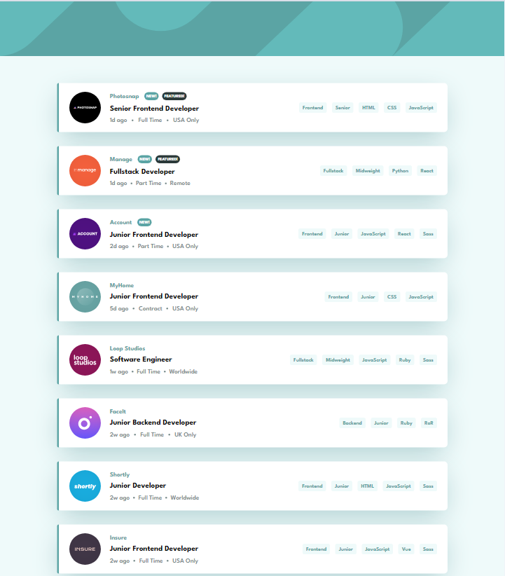
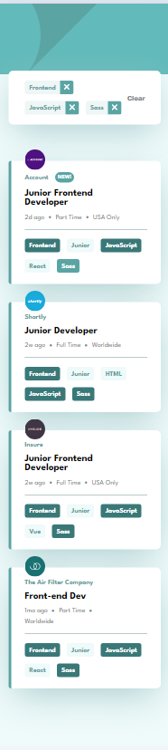

# Frontend Mentor - Job listings with filtering solution

This is a solution to the [Job listings with filtering challenge on Frontend Mentor](https://www.frontendmentor.io/challenges/job-listings-with-filtering-ivstIPCt). Frontend Mentor challenges help you improve your coding skills by building realistic projects.

## Table of contents

- [Overview](#overview)
  - [The challenge](#the-challenge)
  - [Screenshots](#screenshots)
  - [Links](#links)
- [My process](#my-process)
  - [Built with](#built-with)
- [Author](#author)

## Overview

### The challenge

Users should be able to:

- View the optimal layout for the site depending on their device's screen size
- See hover states for all interactive elements on the page
- Filter job listings based on the categories

### Screenshots

### Links

- [Frontend Mentor solution](https://www.frontendmentor.io/solutions/responsive-job-listings-with-filtering-VzlVWcY3_S)
- [GitHub repo](https://github.com/RoksolanaVeres/Job_Listing_With_Filter)
- [Live Site](https://job-listing-with-filter-seven.vercel.app/)

## My process

### Built with

- Semantic HTML5 markup
- Flexbox
- CSS Grid
- Mobile-first workflow
- React

## Author

- Frontend Mentor - [@RoksolanaVeres](https://www.frontendmentor.io/profile/RoksolanaVeres)
